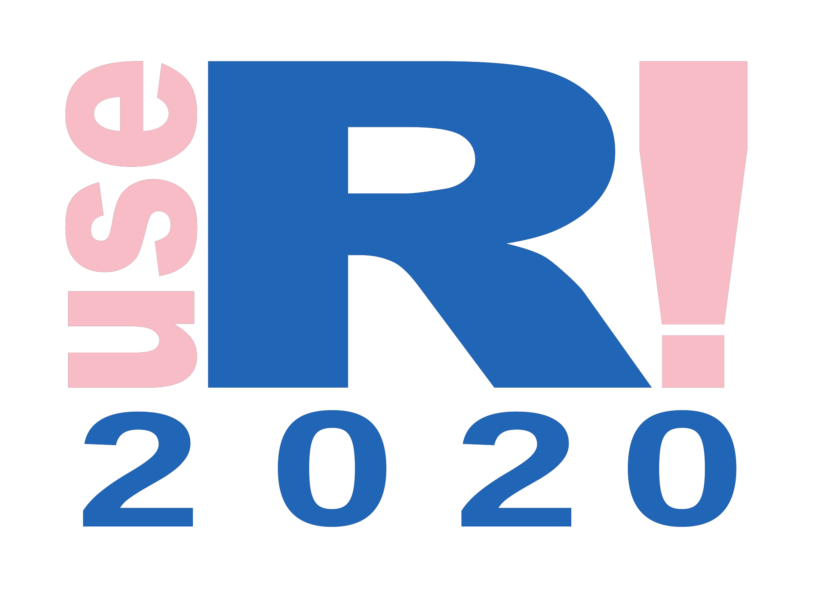

<!-- README.md is generated from README.Rmd. Please edit that file -->
userlogo
========

The goal of userlogo is to customize the useR! logo with

-   the chosen colour for the "use" and "!",

-   the conference year.

Installation
------------

``` r
remotes::install_github("lockedata/userlogo")
```

Example
-------

Default logos.

``` r
magick::image_read_svg(system.file("extdata", "userlogo-withyear.svg",
                           package = "userlogo"))
```


``` r
magick::image_read_svg(system.file("extdata", "userlogo-withyear-square.svg",
                           package = "userlogo"))
```


Make them pink! This will create 2 PNG files and 2 SVG files in the folder you choose.

``` r
dir <- tempdir()
userlogo::create_logo(colour = "#ffc0cb",
                      year = 2020,
                      folder = dir)
#> Called from: modify_logo("userlogo-withyear-square", colour = colour, year = year, 
#>     folder = folder)
#> debug at /home/maelle/Documents/locke_data/userlogo/R/create_logo.R#56: svg <- magick::image_read_svg(svg_path, width = 2177.1023, height = 1574.6538)
#> debug at /home/maelle/Documents/locke_data/userlogo/R/create_logo.R#59: magick::image_write(svg, file.path(folder, paste0(logofile, ".png")))
#> Called from: modify_logo("userlogo-withyear", colour = colour, year = year, 
#>     folder = folder)
#> debug at /home/maelle/Documents/locke_data/userlogo/R/create_logo.R#56: svg <- magick::image_read_svg(svg_path, width = 2177.1023, height = 1574.6538)
#> debug at /home/maelle/Documents/locke_data/userlogo/R/create_logo.R#59: magick::image_write(svg, file.path(folder, paste0(logofile, ".png")))

magick::image_read_svg(file.path(dir, "userlogo-withyear.svg"))
```


``` r
magick::image_read(file.path(dir, "userlogo-withyear.png"))
```


``` r
magick::image_read_svg(file.path(dir, "userlogo-withyear-square.svg"))
```


``` r
magick::image_read(file.path(dir, "userlogo-withyear-square.png"))
```


