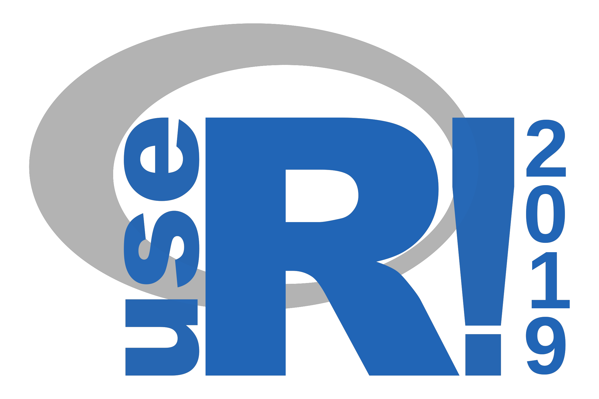
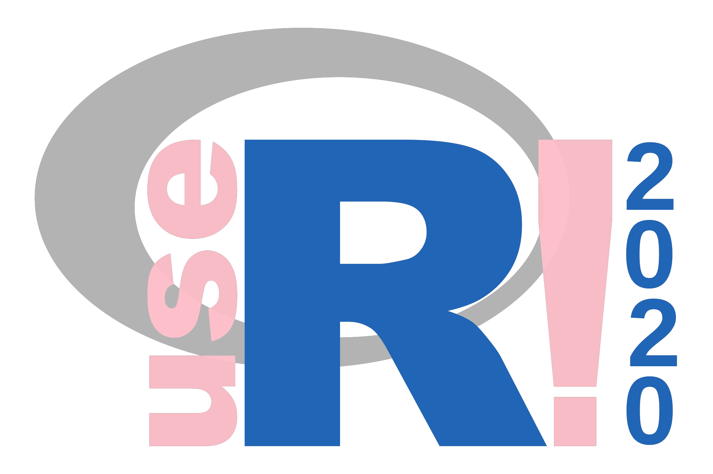

<!-- README.md is generated from README.Rmd. Please edit that file -->

# userlogo

The goal of userlogo is to customize the useR\! logo with

  - the chosen colour for the “use” and “\!”,

  - the conference year.

## Installation

``` r
remotes::install_github("lockedata/userlogo")
```

## Example

Default logo.

``` r
magick::image_read_svg(system.file("extdata", "userlogo.svg",
                           package = "userlogo"))
```



Make it pink\!

``` r
dir <- tempdir()
userlogo::create_logo(colour = "#ffc0cb",
                      year = 2020,
                      folder = dir)

magick::image_read_svg(file.path(dir, "userlogo.svg"))
```



``` r
magick::image_read(file.path(dir, "userlogo.png"))
```


